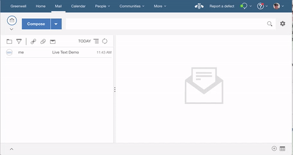

# {{page.title}}

This tutorial will get you started writing a custom name picker extension for Verse.

Structure of the Tutorial:

1. [Add Custom Name Picker Extension](#add-custom-name-picker-extension)
2. [Secure the Application](#secure-the-application)

There is much more detailed documentation available [here][16], but it's not required to complete the tutorial.

This is a follow on tutorial to [Your First Application for IBM Verse](tutorial_verse_developer.html)

---

## 1. Add Custom Name Picker Extension

### Edit applications.json
__1.__ Open `src/applications.json` in your text editor.

__2.__ Append the following object into the array in `applications.json`, and save the file. __Don't forget to add a comma `,` at the end of the preceding application before adding your own__.

```json
  {
    "id": "com.ibm.verse.custom.name.picker",
    "name": "Custom Name Picker",
    "title": "Custom Name Picker",
    "description": "Sample that shows how to add a custom name picker in mail compose view",
    "extensions": [
      {
        "type": "com.ibm.verse.ext.namePicker",
        "ext_id": "com.ibm.verse.namepicker.sample.compose",
        "name": "Custom name picker in mail compose",
        "title": "Add Contact",
        "payload": {
          "url": "${extensionPath}/custom-name-picker/index.html"
        }
      }
    ],
    "payload": {},
    "services": [
      "Verse"
    ]
  }
```

__3.__ __Every time__ you make a change to the extension code, you need to __reload the extension__ first, then __reload Verse,__ so that the browser and Verse will pick up your latest changes.

For instructions on how to reload the extension click [here](./tutorial_verse_developer.html#installing-the-verse-developer-browser-extension).


### Test it out
1. In the Verse UI, click the __Compose__ button.
2. In the Mail Compose view, click on the __To__ link text.
3. From here you can pick someone to send the mail to.
4. When you are done you can return to the message to continue editing.



Congratulations! You successfully registered the custom name picker extension with Verse.

### How it works

* This step introduces a new extension point with the type `com.ibm.verse.ext.namePicker`
* A custom name picker is added to the mail compose view and can be invoked by clicking the To link
* The specified web application is opened in an embedded iframe within the mail compose view
* Verse sends a message to the web application containing context data which includes details of the mail the user is currently editing
* The web application displays an appropriate user interface e.g. it may list suggested names based on the content of the mail being composed
* The web application can send messages to Verse which will cause it to insert email addresses into the currently selected field i.e with To, Cc or Bcc

Below is the snippet of JavaScript which sends a message to Verse to insert an email address into the mail compose view:

```
  var userEmail = this.parentNode.querySelector(".user-email").innerText;
  var userName = this.parentNode.querySelector(".user-name").innerText;
  var emails_message = {
    verseApiType: "com.ibm.verse.add.contact",
    userEmail: userEmail,
    userName: userName
  };
  evt.source.postMessage(emails_message, evt.origin);
```

---

## 2. Secure the Application

Follow the instructions to [secure the application](./tutorial_verse_developer.html#secure-the-application).

---

## Further Reading
1. [Introduction to Verse extensibility][3]{:target="_blank"}
2. [Editing the `manifest.json` file][4]{:target="_blank"}
3. [Working with match patterns in `manifest.json`][2]{:target="_blank"}
4. [Verse API data][5]{:target="_blank"}
5. [Sending and receiving data from Verse][6]{:target="_blank"}
6. [Registering an application in IBM Verse][9]{:target="_blank"}
7. [Introduction to cross-document messaging][11]{:target="_blank"}
8. [Security implementation against cross-site scripting attack][12]{:target="_blank"}
9. [Tips for debugging][14]{:target="_blank"}


[1]: https://chrome.google.com/webstore/detail/web-server-for-chrome/ofhbbkphhbklhfoeikjpcbhemlocgigb
[2]: https://developer.chrome.com/extensions/match_patterns
[3]: ../reference/reference.html#introduction-to-ibm-verse-extensibility
[4]: ../reference/reference.html#editing-the-manifest
[5]: ../reference/reference.html#verse-api-data
[6]: ../reference/reference.html#sending-and-receiving-data
[7]: {{site.verse-developer-chrome-ext}}
[8]: {{site.verse-developer-chrome-ext}}/archive/master.zip
[9]: ../reference/reference.html#registering-an-application-in-ibm-verse
[11]: https://developer.mozilla.org/en-US/docs/Web/API/Window/postMessage
[12]: ../reference/reference.html#security
[14]:../reference/reference.html#troubleshooting
[15]:{{site.verse-developer-chrome-ext}}/blob/master/src/samples/templatedLink.html
[16]:../reference/reference.html
[17]:{{site.verse-developer-chrome-ext}}/blob/master/src/samples/templatedLink.js


