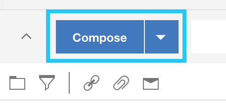
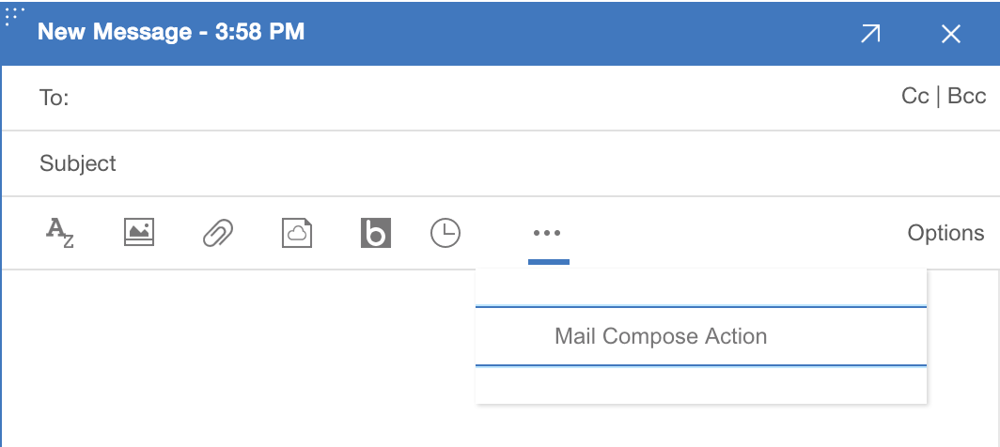

## 3. Add an application for the Mail Compose View

In this section, we will add an action button to the Mail Compose View, and register this new application with Verse.


### Edit widget.json
1. Open `src/widget.json` in your text editor.

2. Append the following object into the array in `widget.json`, and save the file:
  ```JavaScript
  {
    "app_id": "com.ibm.verselabs.actions.sample.mail",
    "name": "Mail Sample",
    "url": "https://yourcompany/mailComposeSample.html",

    "extensions": [
      {
        "type": "com.ibm.verse.action",
        "ext_id": "com.ibm.verselabs.action.sample.person",
        "name": "Person Action Sample",
        "payload": {},
        "path": "mail.compose",
        "title": "Mail Compose Action"
      }
    ],

    "payload": {
      "features": [
        "core"
      ],
      "renderParams": {
        "width": "900",
        "height": "500"
      }
    },

    "services": [
      "Verse"
    ]
  }

  ```
  This is how your diff should look like if you are using Git:
  


### Reload the extension
Open your Chrome browser, go to `chrome://extensions`, find the IBM Verse Developer Extension for Google Chrome, and click `Reload`.


### Reload Verse and test it out
1. Navigate to your Verse URL. If you already have Verse open in your Chrome browser, you need to reload Verse to pick up your latest code changes in the extension.

2. In the Verse UI, click the "Compose" button.


3. In the pop-up Mail Compose View, click on the "More actions" button.


4. In the drop-down menu, click "Mail Compose Action". This will bring up the external application you just registered with the Chrome extension, with information related to the Compose View passed on from Verse.


Congratulations! You have successfully added an action button to the mail compose view, and register the relevant application with Verse.


### How does it work?
In this section, we have added a new extension under a different application ID. It is also possible to add multiple extensions within the same app. In that case, you will append the new extension to the `extensions` array.

Let us have a look at some of the properties in the new application we just added, which are quite different from the previous bizCard application.

Under `extensions`, instead of using `object: "person"`, our new application uses `path: "mail.compose"`. This indicates the action button should be located at the Mail Compose View.

Under `payload`, instead of using `preferences`, the new extension we just added uses `"features": ["core"]`. `preferences` is used to set the URL parameters, while `"features": ["core"]` indicates we will be using cross-document messaging. In this application, we will not be using URL to pass data from Verse, but will use cross-document messaging instead.


### Further readings:
1. [Working with the widget.json file][1]
2. [Sending data from Verse][2]
3. [Introduction to cross-document messaging][3]

[1]: {{site.baseurl}}/tutorials/ext-manifest.html
[2]: {{site.baseurl}}/tutorials/ext-send-data-to-app.html
[3]: https://html.spec.whatwg.org/multipage/comms.html#web-messaging
